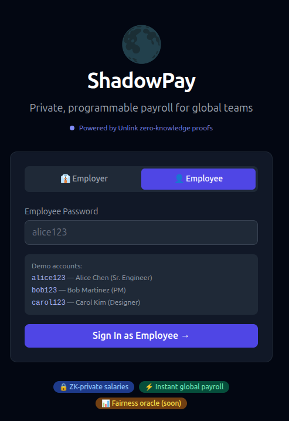
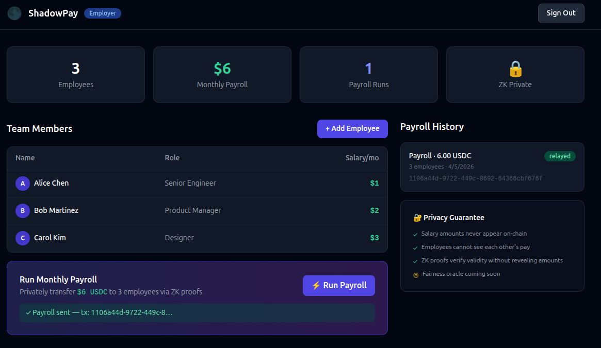
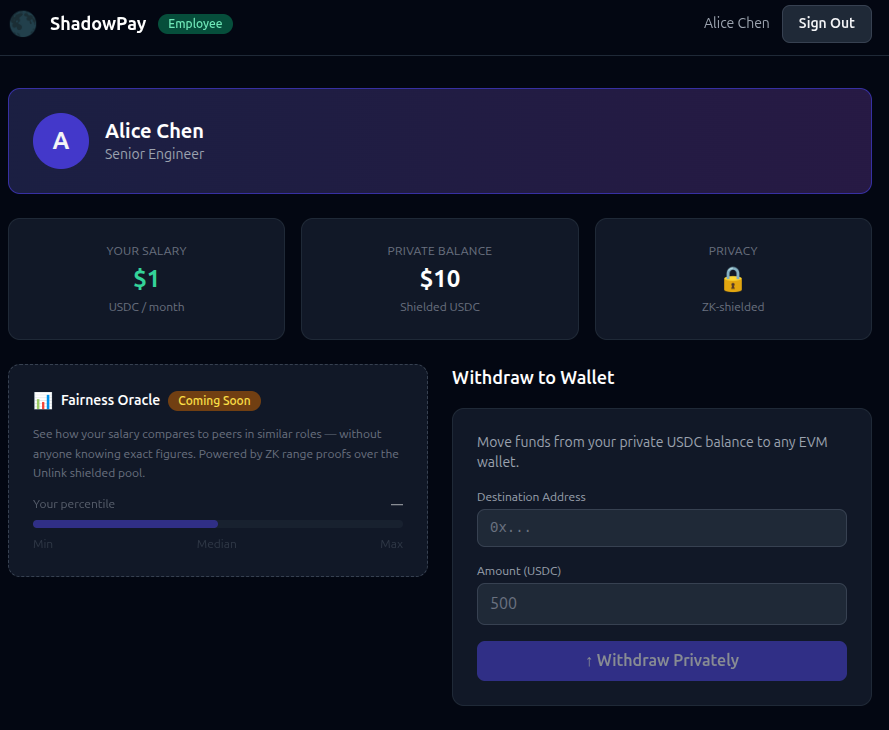

# ShadowPay

This project was developed as part of the [ETHGlobal Cannes 2026](https://ethglobal.com/events/cannes2026) hackathon. Employers can run monthly payroll seamlessly while leveraging [Unlink](https://unlink.xyz) to keep salaries private. Employees receive their payments in shielded balances, ensuring that each person’s exact compensation remains confidential. Zero-knowledge proofs allow full access and withdrawal of funds without revealing individual salaries, combining payroll efficiency with strong privacy protections.

## Architecture

- Full-stack **ShadowPay** hackathon app: private, programmable payroll for global teams powered by [Unlink](https://unlink.xyz) zero-knowledge proofs
- Employer dashboard: add employees, run payroll (bulk ZK transfers)
- Employee dashboard: view own salary, private shielded balance, withdraw to EVM wallet
- Vercel deployment config for frontend (Vite/Vue 3) + backend (Express serverless)

## Tech Stack

| Layer | Tech |
|---|---|
| Frontend | Vue 3 + Vite + Tailwind CSS + Pinia |
| Backend | Express (local) / Vercel serverless (prod) |
| Privacy | `@unlink-xyz/sdk` — ZK-shielded transfers, real bech32m Unlink addresses |

## Vercel Deployment

Import the repo in [vercel.com](https://vercel.com), then add these environment variables:

| Variable | Description |
|---|---|
| `UNLINK_API_KEY` | From [unlink.xyz](https://unlink.xyz) dashboard |
| `UNLINK_ENGINE_URL` | `https://staging-api.unlink.xyz` |
| `MASTER_MNEMONIC` | BIP-39 mnemonic — index 0 = employer, index N = employee N |
| `EMPLOYER_PRIVATE_KEY` | private key for employer account |
| `EMPLOYER_PASSWORD` | Password for the employer dashboard |
| `RPC_URL` | RPC to base sepolia |

## Demo credentials

- Employer: `employer123`
- Alice Chen (Sr. Engineer, $1/mo): `alice123`
- Bob Martinez (PM, $2/mo): `bob123`
- Carol Kim (Designer, $3/mo): `carol123`

## Token

USDC on base sepolia is used as payment token: 0xC1a5D4E99BB224713dd179eA9CA2Fa6600706210

## AI Assistance

**Claude** (AI assistant) was used to aid in code generation, testing, deployment, and workflow automation.

> **Security Note:** To ensure safety while experimenting with AI and untrusted code/libraries, all AI interactions were performed in isolated environments using a dedicated GitHub account and virtual machines. Certain agentic workflows had full control of this codebase, and not all parts of the code underwent in-depth human review.

For reference, my main GitHub account is: [DOBEN](https://github.com/DOBEN)

## Screenshots

LoginScreen

EmployerDashboard

EmployeeDashboard

